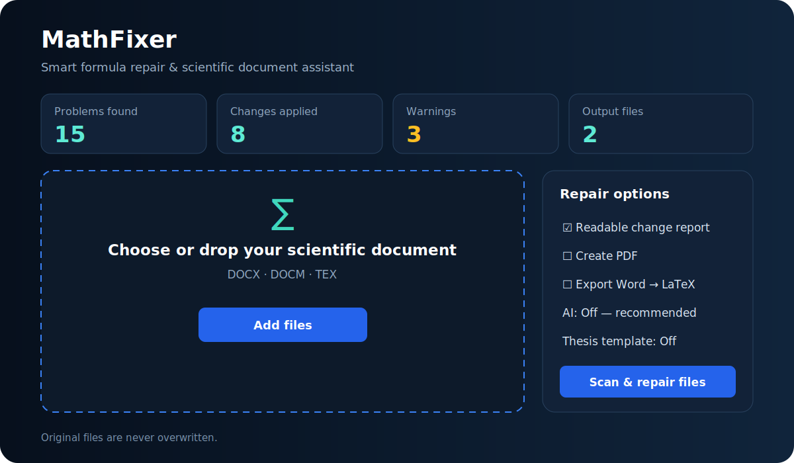
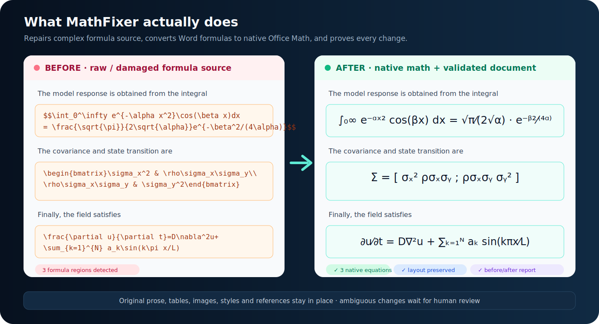

# MathFixer

## Native math repair, LaTeX project diagnostics, and scientific-document validation

**MathFixer finds formula source inside Word and LaTeX projects, repairs only conservative syntax problems, converts Word formulas to native Office Math, validates the output, and records every decision in a before/after report.** It is designed for students, thesis writers, researchers, editors, and university support teams—not only programmers.

[راهنمای کامل فارسی](README_FA.md) · [Latest Windows release](https://github.com/MahdiMazinani/MathFixer/releases/latest) · [Security](SECURITY.md) · [Architecture](docs/ARCHITECTURE.md)



## Understand the product in one image

The left side is what often appears in a manuscript: raw LaTeX, damaged delimiters, or UnicodeMath typed as ordinary Word text. The right side is the intended result: native equations inside the same document, with prose, tables, images, styles, and references preserved.



MathFixer is not a generic text rewriter. Its primary job is **formula and scientific-document repair with evidence**.

## Choose your workflow

| Your input | Use this workflow | Main output |
|---|---|---|
| Word `.docx` / `.docm` containing LaTeX or UnicodeMath | One-click **Scan & repair files** | Layout-preserved Word file with native Office Math |
| Single `.tex` file | One-click **Scan & repair files** | Repaired copy plus HTML/JSON report |
| Multi-file LaTeX thesis | Complete LaTeX project mode | Copied project with included sources repaired and cross-file diagnostics |
| Word project that must become LaTeX | Project conversion | Standalone TEX plus extracted `media/` directory |
| LaTeX project that must become Word | Project conversion | DOCX using project media and optional reference DOCX |
| Original and repaired PDF | Compare PDFs | Page heatmaps and `visual-comparison.json` |
| Report that must be reviewed elsewhere | Review bundle | Offline `.mfxreview` file; source excluded by default |

## Install on Windows without Python

### Portable version

1. Open the [latest Release](https://github.com/MahdiMazinani/MathFixer/releases/latest).
2. Download `MathFixer-Windows-Portable.zip`.
3. Extract the ZIP completely.
4. Double-click `MathFixer.exe`.

Pandoc and the required Python runtime are bundled. Do not run the EXE from inside the ZIP.

### Installer

When a release contains `MathFixer-Setup.exe`, download it and follow the installer. A release is Authenticode-signed only when the project owner configures a code-signing certificate. If it is unsigned, Windows SmartScreen may show a warning; verify the checksum and publisher source before continuing.

### Verify the download

Every release contains `SHA256SUMS.txt`.

```powershell
Get-FileHash .\MathFixer-Windows-Portable.zip -Algorithm SHA256
Get-Content .\SHA256SUMS.txt
```

The two hashes for the same filename must match exactly.

## Five-minute desktop tutorial

### 1. Add documents

Drag `.docx`, `.docm`, or `.tex` files into the large drop area, or select **Add files**. **Add folder** adds supported documents from a folder. A batch can contain Word and LaTeX files together.

The original file is never the output. MathFixer uses a suffix such as `_mathfixed` or creates a sibling repaired-project directory.

### 2. Select detection behavior

- **Balanced — recommended:** explicit LaTeX, damaged delimiters, UnicodeMath, and clear equation-only lines.
- **Safe:** only formula regions with explicit delimiters; best when prose contains many symbols.
- **Aggressive:** includes strong plain-equation candidates; requires careful review.

Detection does not modify the document.

### 3. Choose outputs

- **Readable HTML + JSON reports:** recommended for every important document.
- **Atomic mode:** if any selected Word formula cannot be converted safely, publish no incomplete document. After failure, MathFixer automatically prepares detected items for **Review selected**; disable or correct a false positive and retry.
- **Create PDF:** optional. In the GUI, Word and LibreOffice each get 45 seconds. PDF failure preserves the validated Word output and appears as a warning.
- **Export Word to LaTeX:** creates an additional LaTeX result.
- **AI diagnostics:** **Off — recommended** makes no AI request. Selecting a provider explicitly sends TEX text and may wait up to 90 seconds.
- **Complete LaTeX project:** follows safe local `\input`, `\include`, and `\subfile` references and repairs a copied project.
- **Replace outputs:** allows an already existing output to be replaced.

Keep the thesis profile at **Off — no university template** for ordinary documents. Select a university only when its user-provided `.cls` or `.sty` is present. Profile names are diagnostics, not official templates or endorsements.

### 4. Scan and repair with one button

Select **Scan & repair files** once. Detection, repair, validation, and output creation run in sequence. Word is scanned only once on the default path. If AI was explicitly enabled for TEX, its diagnostic preflight runs first and the status bar shows the waiting stage and timeout.

For Word files, the queue row now shows the active stage: opening, formula scan, Pandoc conversion, safe patching, writing, or validation. Pandoc has a 30-second batch limit and a 45-second limit for the complete formula-conversion stage. A timeout stops the process tree and fails safely instead of being repeated for every remaining batch. Documents with no detected formulas do not start Pandoc at all.

After completion, the dashboard shows problems, repairs, warnings, and output counts. Double-click a row or use **Review selected**.

For Word formulas you can:

- disable a false positive;
- edit the normalized formula before conversion;
- inspect detection type, confidence, and repair reasons.

For LaTeX projects the review includes:

- before and after source;
- exact relative file and line;
- missing citation/reference/package findings;
- compilation-log, Persian, template, and plugin diagnostics.

A successful Word output is published only after OOXML preservation validation. A complete LaTeX project is copied to a sibling output directory before included sources are changed.

### 5. Inspect the evidence

Use **Change report** to open the HTML report. It includes:

- before and after formula source;
- why the repair was proposed;
- document part, project file, paragraph, or line;
- warnings with code, severity, suggestion, and location;
- detected, converted, and skipped totals.

Use **Open output** only after reviewing the report for high-value documents.

## What happens to Word documents

MathFixer scans the main document, headers, footers, footnotes, endnotes, and supported story parts. Formula candidates are compiled as isolated fragments through Pandoc and inserted as Office Math ML (OMML). Pandoc never rebuilds the whole Word file.

Preservation checks verify that:

- package entries were not unexpectedly added or removed;
- unmodified ZIP parts remain byte-identical;
- ordinary text around formulas is unchanged;
- tables, drawings, relationships, and section structure remain valid;
- the native-math object delta equals the successful conversion count.

Equation-only display formulas become block-level `m:oMathPara`; inline formulas remain inline.

## Complete LaTeX project analysis

Opening a main TEX file builds a bounded workspace index. MathFixer follows only relative source references that stay inside the project root. It currently understands `\input`, `\include`, and `\subfile`.

Project diagnostics include:

- missing or unsafe included files;
- citation keys across declared BibTeX resources;
- missing references and duplicate labels across included sources;
- exact file/line locations for repair candidates;
- missing packages, unbalanced braces, and table-environment mismatch;
- nested log-file context for TeX compile errors;
- Persian/XeLaTeX, font, and bidi checks;
- user template-adapter requirements;
- third-party plugin diagnostics.

Safety limits prevent unbounded include graphs and oversized source workspaces. Paths outside the project root are reported and never read.

## Persian thesis workflow

Persian diagnostics check common issues around:

- XeLaTeX-oriented compilation;
- `xepersian` configuration;
- Persian and Latin font declarations;
- bidi environments and direction-sensitive content;
- missing bibliography keys and references;
- presence of a user-provided university class/style.

Built-in compatibility labels exist for Sharif, University of Tehran, Amirkabir, Tabriz, and Islamic Azad University. MathFixer does not redistribute copyrighted templates. Use a template supplied or licensed by the user.

### Custom template adapter

Copy [the example manifest](examples/template-adapter.example.json), then edit required files and commands:

```json
{
  "name": "My University Thesis Template",
  "version": "1.0.0",
  "api_version": "2.0",
  "profile": "custom-university",
  "engine": "xelatex",
  "required_files": ["university-thesis.cls"],
  "required_commands": ["\\universitytitle", "\\supervisor"]
}
```

```bash
mathfixer scan thesis/main.tex --template-adapter adapter.json --json scan.json
mathfixer project-repair thesis/main.tex thesis-fixed --template-adapter adapter.json --report
```

Adapters are data-only and cannot execute template code.

## PDF creation and visual comparison

DOCX PDF export prefers Microsoft Word on Windows and then LibreOffice. Each GUI engine has a 45-second timeout and its child process tree is stopped when that limit is exceeded. If both engines fail, the validated DOCX remains available and the row is marked **Completed with warnings**. DOCM PDF export is accepted only through Word with VBA automation force-disabled; LibreOffice DOCM export is rejected because macro behavior cannot be verified. TEX PDF export requires XeLaTeX.

To compare two PDFs in the GUI, choose **Compare PDFs**, select original and repaired files, and select an output folder. MathFixer renders every page, checks page count and geometry, computes a pixel-difference ratio, writes red difference heatmaps, and saves `visual-comparison.json`.

CLI example:

```bash
mathfixer pdf-compare original.pdf repaired.pdf pdf-diff --dpi 120 --tolerance 0.002
```

Visual comparison detects change; it does not decide whether a scientific change is correct.

## Project conversion and media

### Word → LaTeX project

```bash
mathfixer project-convert thesis.docx thesis-latex
```

The output contains a standalone TEX file and extracted media. The target is staged and published atomically. Existing non-empty directories require `--overwrite`.

### LaTeX project → Word

```bash
mathfixer project-convert thesis/main.tex thesis.docx
mathfixer project-convert thesis/main.tex thesis.docx --reference-docx university-style.docx
```

Pandoc receives the TEX project root as its resource path so local figures can be resolved. Output DOCX is validated before publication.

Conversion between formats is not guaranteed to preserve every custom macro, float, bibliography style, or university class. Keep the source project and review the result.

## Optional AI providers

AI is advisory: it can explain errors and suggest actions but never applies a change automatically. The GUI selector explicitly defaults to **Off — recommended**; this makes no AI request. OpenAI, compatible, and Ollama choices affect TEX only and may wait for the 90-second timeout. Deterministic repair remains available without a network connection or account.

### OpenAI Responses provider

```powershell
$env:OPENAI_API_KEY="your-key"
$env:MATHFIXER_AI_MODEL="gpt-5-mini"
```

Select **OpenAI** in the desktop provider list or use:

```bash
mathfixer scan thesis.tex --ai-provider openai
```

### OpenAI-compatible private endpoint

```powershell
$env:MATHFIXER_AI_ENDPOINT="https://ai.example.edu/v1/chat/completions"
$env:MATHFIXER_AI_MODEL="institution-model"
$env:MATHFIXER_AI_API_KEY="your-private-key"
```

```bash
mathfixer scan thesis.tex --ai-provider openai-compatible
```

Remote endpoints must use HTTPS. Plain HTTP is accepted only for localhost/private IP addresses.

### Ollama on the same computer

```powershell
$env:MATHFIXER_AI_ENDPOINT="http://127.0.0.1:11434/api/generate"
$env:MATHFIXER_AI_MODEL="qwen2.5-coder:7b"
```

```bash
mathfixer scan thesis.tex --ai-provider ollama
```

API keys and provider configuration are read from environment variables and are not stored by the desktop app.

## Offline and optional collaboration

MathFixer has no mandatory cloud account. Create an offline review bundle from a JSON report:

```bash
mathfixer review-bundle thesis.report.json review.mfxreview
```

The source document is excluded by default. Source inclusion must be explicit:

```bash
mathfixer review-bundle thesis.report.json review.mfxreview --include-source thesis.tex
```

The Python API also provides an opt-in upload client for a user-configured HTTPS/private collaboration service. The repository does not claim to operate a public MathFixer cloud backend.

## Output files

| File | Meaning |
|---|---|
| `*_mathfixed.docx` | Validated Word copy with selected native equations |
| `*_mathfixed.tex` | Repaired TEX copy |
| `*_mathfixed_project/` | Copied and repaired multi-file TEX project |
| `*.report.html` | Human-readable changes and diagnostics |
| `*.report.json` | Machine-readable audit data |
| `*.pdf` | Optional validated PDF |
| `page-###-diff.png` | Visual PDF difference heatmap |
| `visual-comparison.json` | PDF comparison metrics |
| `*.mfxreview` | Portable review bundle |

## Security and privacy model

- DOCX/DOCM is treated as an untrusted ZIP package.
- DTD loading, external XML entities, and XML network access are disabled.
- Duplicate/encrypted entries, suspicious compression ratios, oversized packages, and unsafe XML are rejected.
- Project includes may not escape the source root.
- DOCM macros are never executed by MathFixer; Word PDF automation force-disables VBA.
- AI and collaboration are explicit opt-in operations.
- Source files are not included in review bundles unless the caller gives explicit consent.
- Output publication is atomic where supported.

Read [SECURITY.md](SECURITY.md) before deploying MathFixer as a service.

## Known boundaries

MathFixer does not:

- OCR equations that exist only as images;
- invent bibliography entries or academic sources;
- guarantee semantic correctness of an equation;
- silently rewrite academic prose;
- execute DOCM VBA or arbitrary adapter code;
- redistribute official university templates;
- guarantee lossless round-trip conversion for every custom Word/LaTeX feature;
- provide a hosted collaboration service.

Ambiguous candidates require human review.

## Troubleshooting

| Problem | What to check |
|---|---|
| Pandoc missing | Use the portable Windows release, or install Pandoc and run `mathfixer doctor` |
| No formulas detected | Try Balanced mode; use Aggressive only after reviewing false positives |
| Too many false positives | Switch to Safe mode and keep explicit `$...$`, `\(...\)`, or display delimiters |
| First conversion failed | Choose **Review selected** after automatic recovery; disable or correct false positives, then retry |
| Conversion stays at the Pandoc/formula stage | Version 2.0.3 stops the complete Pandoc stage after at most 45 seconds. If an older version waits longer, close it, install the latest Release, and retry. The original file is unchanged |
| Conversion stays near 90% | Optional PDF export is running; each engine is stopped after 45 seconds and valid Word output is preserved with a warning |
| PDF cannot be created | Install Word/LibreOffice for DOCX or XeLaTeX for TEX; retrieve the validated Word file with **Open output** |
| DOCM PDF rejected | Use Microsoft Word on Windows; LibreOffice DOCM PDF is intentionally blocked |
| AI unavailable | Verify provider selection and environment variables; deterministic repair still works |
| Include reported unsafe | Move the included TEX file inside the project root and use a relative path |
| Missing citation is incorrect | Declare the correct `.bib` with `\bibliography` or `\addbibresource` |
| SmartScreen warning | Verify SHA-256; public trust requires an Authenticode certificate |
| Output already exists | Choose another suffix/folder or explicitly enable replacement |

## Command-line cookbook

```bash
# Dependency check
mathfixer doctor

# Read-only scans
mathfixer scan thesis.docx --mode balanced --json word-scan.json
mathfixer scan thesis/main.tex --json latex-scan.json

# Word and single-TEX repair
mathfixer convert article.docx --report --pdf
mathfixer convert chapter.tex --report

# Complete multi-file TEX repair
mathfixer project-repair thesis/main.tex thesis-fixed --report --pdf

# Media-aware format conversion
mathfixer project-convert thesis.docx thesis-latex
mathfixer project-convert thesis/main.tex thesis.docx --reference-docx style.docx

# Visual regression
mathfixer pdf-compare before.pdf after.pdf pdf-diff

# Plugin/adapter inspection
mathfixer plugins
mathfixer plugins --template-adapter adapter.json

# Offline review package
mathfixer review-bundle thesis.report.json thesis-review.mfxreview
```

Run `mathfixer <command> --help` for every option.

## Python API v2

The public API version is independent from the package patch version.

```python
from mathfixer import API_VERSION, DetectionMode, repair, scan
from mathfixer.features.pdf_compare import compare_pdfs
from mathfixer.features.project_conversion import word_to_latex_project

report = scan("thesis/main.tex", thesis_profile="generic")
for finding in report.findings:
    print(finding.file, finding.line, finding.code, finding.message)

repair(
    "article.docx",
    "article_mathfixed.docx",
    mode=DetectionMode.BALANCED,
    overwrite=False,
)

word_to_latex_project("article.docx", "article-latex")
visual = compare_pdfs("before.pdf", "after.pdf", "pdf-diff")
print(API_VERSION, visual.passed, visual.changed_ratio)
```

## Plugin SDK v2

Python diagnostics plugins publish an entry point in the `mathfixer.plugins` group and implement this read-only contract:

```python
from mathfixer.plugins import PluginContext, PluginDiagnostic

class MyPlugin:
    name = "my-lab-rules"
    version = "1.0.0"
    api_version = "2.0"

    def analyze(self, context: PluginContext) -> list[PluginDiagnostic]:
        return [
            PluginDiagnostic(
                code="LAB_POLICY",
                message="Example diagnostic",
                suggestion="Explain a verifiable action",
                file=context.main_file.name,
                plugin=self.name,
            )
        ]
```

Plugins return diagnostics; they do not receive a source-writing API. Incompatible or failing third-party plugins become isolated findings instead of crashing the application.

## Developer setup

```bash
git clone https://github.com/MahdiMazinani/MathFixer.git
cd MathFixer
python -m venv .venv
# Windows: .venv\Scripts\activate
# macOS/Linux: source .venv/bin/activate
python -m pip install -e ".[gui,dev]"
mathfixer doctor
mathfixer-gui
```

If editable installation is intentionally skipped, run tests with `PYTHONPATH=src`.

```bash
ruff check .
python -m compileall -q src
python -m unittest discover -s tests -v
```

CI covers Windows/Linux, Python 3.10–3.12, GUI construction, CodeQL, and release builds.

### Windows build

```powershell
.\scripts\build_windows.ps1 -Python python
.\scripts\build_installer.ps1 -Version 2.0.0
```

For signing, pass a PFX path/password to `build_installer.ps1`. GitHub Actions recognizes `MATHFIXER_CERTIFICATE_BASE64` and `MATHFIXER_CERTIFICATE_PASSWORD` secrets. Without them the installer is correctly labeled unsigned.

## Version status

- **v1.3 scope:** multi-file evidence, exact log locations, template adapters, visual PDF regression, installer/signing integration.
- **v2.0 scope:** stable plugin/API contract, bidirectional project conversion with media, private/local AI providers, and opt-in collaboration bundles.
- **v2.0.3 reliability patch:** bounded Pandoc conversion, retained GUI workers, visible processing stages, and frozen-EXE conversion smoke coverage.

See [CHANGELOG.md](CHANGELOG.md) and [ROADMAP.md](docs/ROADMAP.md) for release details.

## License

MathFixer is MIT-licensed. Bundled Pandoc remains GPL-2.0-or-later; distributors must follow [THIRD_PARTY_NOTICES.md](THIRD_PARTY_NOTICES.md). Third-party university templates and plugins keep their own licenses.
