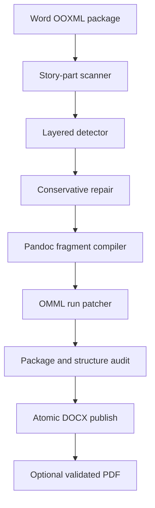

# Architecture

MathFixer separates document safety from formula interpretation.

## Modules

- `detector.py` finds explicit TeX, damaged delimiter sequences, raw environments, UnicodeMath, and strict plain equations. It does not mutate XML.
- `repair.py` normalizes individual candidates and records every nontrivial repair.
- `pandoc_backend.py` batches unique formulas through Pandoc and extracts only `m:oMath` fragments from Pandoc's temporary DOCX.
- `docx_engine.py` maps formula offsets across split Word runs, inserts OMML, copies all package members, and enforces preservation invariants.
- `gui.py` provides asynchronous batch processing, drag/drop, review, opt-out, and manual normalization edits.
- `i18n.py` contains parity-tested Persian and English interface catalogs.
- `pdf_export.py` exports the validated DOCX through Microsoft Word COM or LibreOffice and validates the resulting PDF.
- `cli.py` exposes deterministic scan, conversion, audit, and dependency checks.

## Trust boundaries

Input packages are checked for type, required OOXML entries, expanded size, and suspicious compression ratios. Macros are copied but never loaded or executed. External conversion receives formula strings only. Output is written to a temporary file in the destination directory and atomically renamed only after validation.

## Deliberate refusal cases

MathFixer skips a candidate if it crosses a complex Word structure such as a field, drawing, hyperlink wrapper, or bookmark boundary. Flattening such a structure could change semantics or layout. The skip is explicit in the report and the surrounding document remains untouched.
